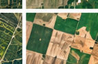

# 🌱 TerraGrow — Geo-Spatial Land Analysis

**Upload satellite / drone imagery → get Farmland / Barren / City / Water breakdown in seconds.**

🌐 **Live Demo:** https://terragrow.pages.dev/
💻 **Repo:** https://github.com/sankeerth1907/terra-grow

TerraGrow segments every pixel of an image into 4 land-cover classes and returns percentage coverage, hectare estimates, cultivation advice, and a segmented overlay mask. Works 100% in-browser — no install needed. Optionally connect a Python backend or Cloudflare Worker for batch processing, trained models, and farm monitoring.



---

## ✨ Features

- 📤 **Drag & drop upload** — PNG / JPG / TIFF-converted, single or batch
- 🛰️ **4-class segmentation:** Farm (green) / Barren (brown) / City (gray) / Water (blue)
- 📊 **Live dashboard** — donut chart, aggregate + per-image table, CSV + Report export
- 📐 **Area estimation** — set ground resolution (m/px, e.g. Sentinel-2 = 10) → total ha, per-class ha, underutilised barren land
- 🌾 **Agri-advisory** — verdict, cultivation score, water status (deficit / ideal / excess)
- 🖥️ **Frontend-only mode** — Canvas classifier in `analyzer.js`, works offline
- 🐍 **Python backend** — Flask API + hook for your own `model.onnx / .h5 / .pt`
- ☁️ **Cloudflare full-stack** — Worker API + R2 + D1: farms, imagery, recommend, monitor, alerts, weekly cron

## 🚀 Quick Start (frontend only — 30 seconds)

No install. Just serve the folder (browsers block `fetch()` of sample tiles on `file://`):

```bash
python -m http.server 8000
# open http://localhost:8000 → Upload Images → Analyze all
# or click "Load sample tiles" to test with bundled tile_*.png mosaic
```

Or just use the live site: **https://terragrow.pages.dev/**

## 🐍 Full Stack — Python Backend

```bash
pip install -r requirements.txt
python app.py  # -> http://127.0.0.1:5000
```

- Single: `POST http://127.0.0.1:5000/api/analyze` (form field `image`, optional `gsd_mpx`)
- Batch: `POST /api/analyze-batch` (form field `images`, multiple)
- Returns: `{ counts, percentages, mask_png_base64, verdict, engine, area }`
- In the site, tick **Use Python backend if running → Test → Analyze**

Test with curl:

```bash
curl -F "image=@tile_r04_c04.png" http://127.0.0.1:5000/api/analyze
```

### 🧠 Plug Your Trained Model

1. Drop `model.onnx` / `model.h5` / `model.pt` next to `app.py`
2. Set `USE_TRAINED_MODEL = True` and implement `run_trained_model()` — must return H×W ids: `0=farm, 1=barren, 2=city, 3=water`
3. Response format is unchanged → frontend needs no changes. `engine` field tells you which path ran (`heuristic-v1` vs `trained-model`).

## ☁️ Cloudflare Full Stack (Worker + Pages + D1)

Local run (two terminals):

```bash
# 1. Worker API with local R2 + D1
npx wrangler dev --local --port 8788   # -> http://127.0.0.1:8788/api/health
# 2. Frontend
python -m http.server 8000             # -> http://localhost:8000
```

In the page, scroll to **Farm dashboard → Test**, then create a farm and use Imagery / Recommend / Monitor / Alerts. **Save current analysis to cloud** pushes browser results into the Worker.

Tests (mocked D1/R2, stub model + webhook — no cloud account needed):

```bash
npm test          # phase12 + phase3 + phase5 + geo + area
npm run test:load # 30 rapid analyses
```

Deploy:

```bash
wrangler login
wrangler r2 bucket create terragrow-images
wrangler d1 create terragrow-db  # paste id into wrangler.toml
npm run db:remote                 # apply schema.sql + crop calendar
npm run deploy                    # Worker -> https://terragrow-api.<you>.workers.dev
npm run pages                     # frontend -> Pages
```

Optional secrets (all best-effort, pipeline never breaks without them):

```bash
wrangler secret put MODEL_API_KEY
wrangler secret put NOTIFY_API_KEY
wrangler secret put SENTINEL_HUB_KEY
```

**API map:**
`GET /api/health` · `POST /farms` · `GET /farms` · `GET /farms/:id` ·
`GET /farms/:id/imagery|recommend|monitor|alerts` · `POST /alerts/:id/resolve` ·
`POST /internal/ingest` · `POST /internal/analyze` (weekly cron) ·
`POST /api/analyze` · `POST /api/results` · `GET /api/results|stats` · `GET /api/file/:key`

## 🧬 How Classification Works (heuristic fallback)

Per-pixel rules calibrated on sample tiles, mirrored in both `analyzer.js` and `app.py`:

- **Water** = blue/teal dominant
- **City** = bright/low-saturation gray-white + red rooftops
- **Farm** = green dominant
- **Barren** = warm red/brown dominant (default)

Replace with your CV model for production accuracy.

## 📁 Project Structure

| File | Role |
|------|------|
| `index.html` / `styles.css` / `analyzer.js` | UI + in-browser classifier + farm dashboard |
| `geo.js` | Ground resolution → hectare + underutilised-land + yield estimates |
| `app.py` | Flask API + heuristic fallback + trained-model hook |
| `src/index.js` | Cloudflare Worker: ingest, farms, recommend, monitor, alerts, stats |
| `wrangler.toml` / `schema.sql` / `schema-002.sql` | R2 + D1 bindings, cron, DB schema + crop calendar |
| `tests/` | phase12, phase3, phase5, geo, area, load tests |
| `tile_*.png` | Sample satellite mosaic tiles for demo |

## 🛠️ Tech Stack

Frontend: HTML/CSS/JS + Canvas + Chart.js · Backend: Python Flask + Pillow + NumPy · Cloud: Cloudflare Workers / Pages / R2 / D1 + Wrangler · Models: ONNX / PyTorch / TF (pluggable)

## 👤 Author

**Sankeerth** — https://github.com/sankeerth1907/terra-grow
Live site: https://terragrow.pages.dev/
